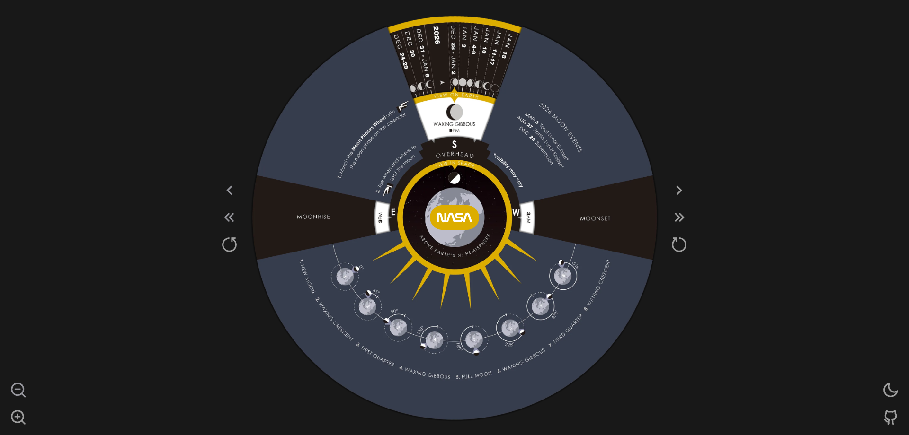
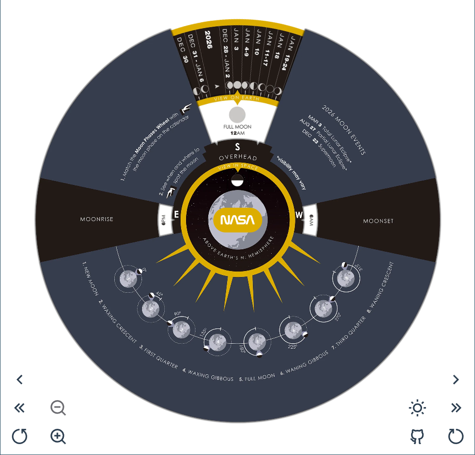
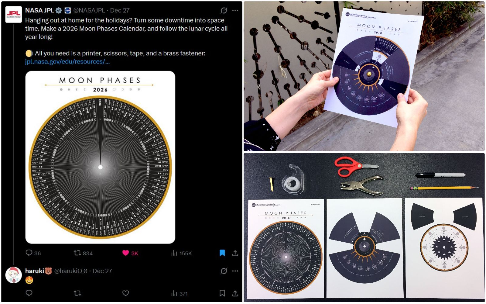

  

<h1 align="center">
  Moon Phases
</h1>

  <!-- Vue.js -->
  
  <!-- TailwindCSS -->
  
  <!-- License -->
  

  <a href="./README.md">English</a> | 简体中文

- 一个使用 Vue3 构建的月相日历和计算器。
- 预览： https://moon-phases.sakiko.top
- 项目地址： https://github.com/haruki1953/moon-phases

📸 <b>更多预览</b>

NASA 的这个月相日历好有趣：
https://www.jpl.nasa.gov/edu/resources/project/make-a-moon-phases-calendar-and-calculator/

刚看到这条推文时就想马上做一个，但是自己没有彩色打印机，怎么办呢？于是想到了用前端来做这个，也算是做上赛博手工了（
